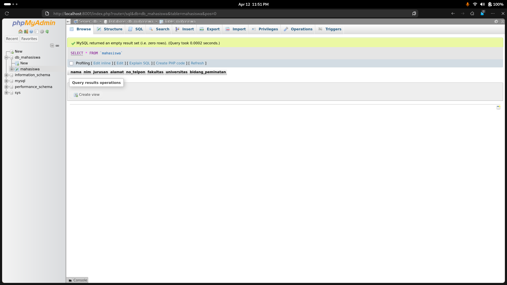
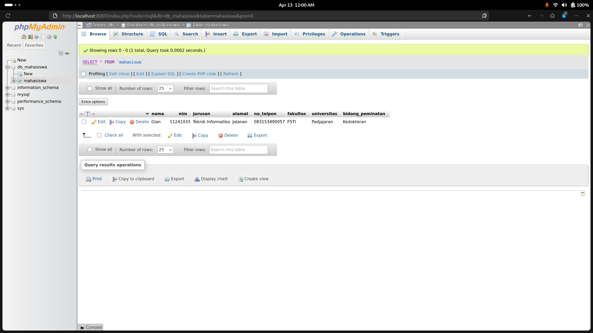
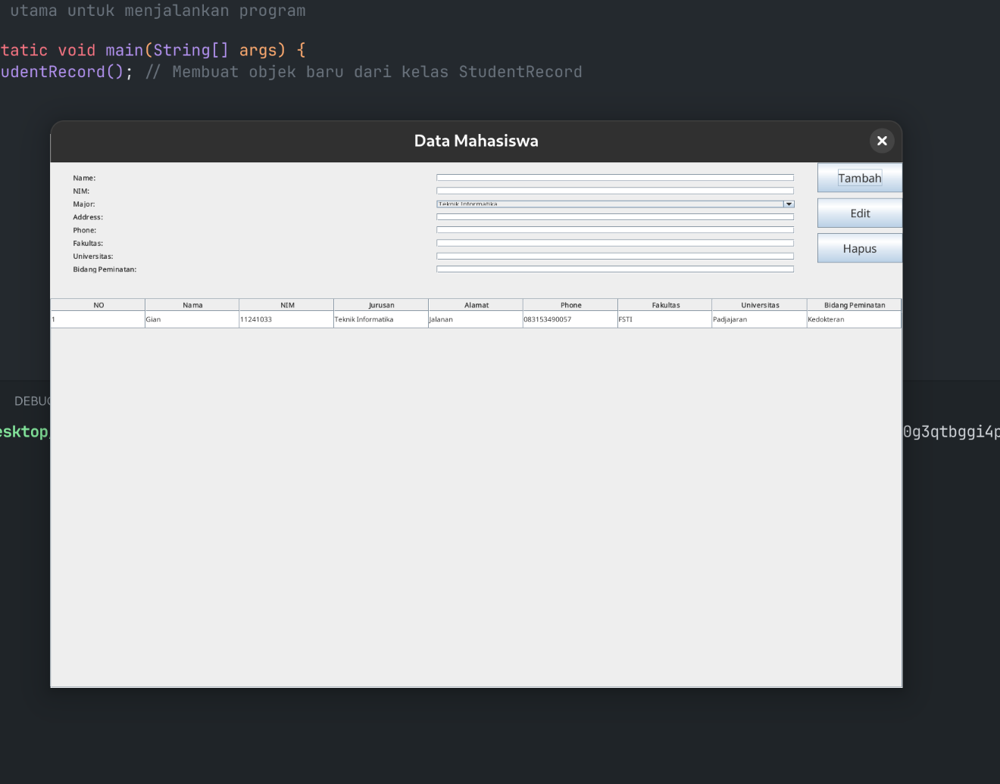
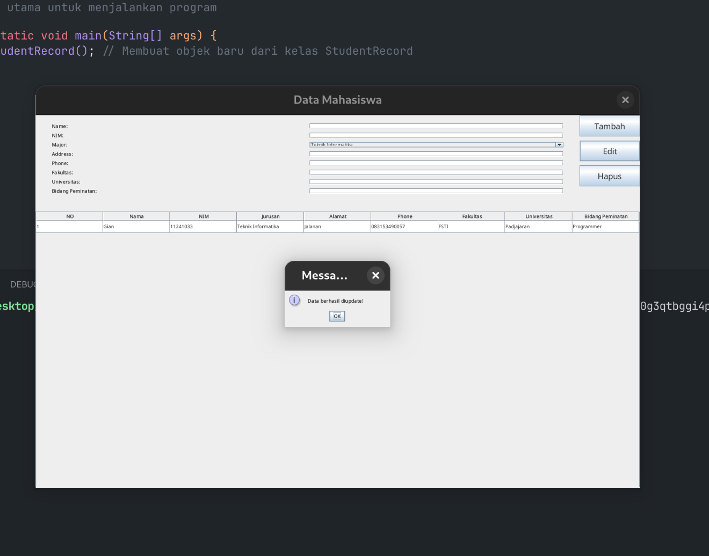
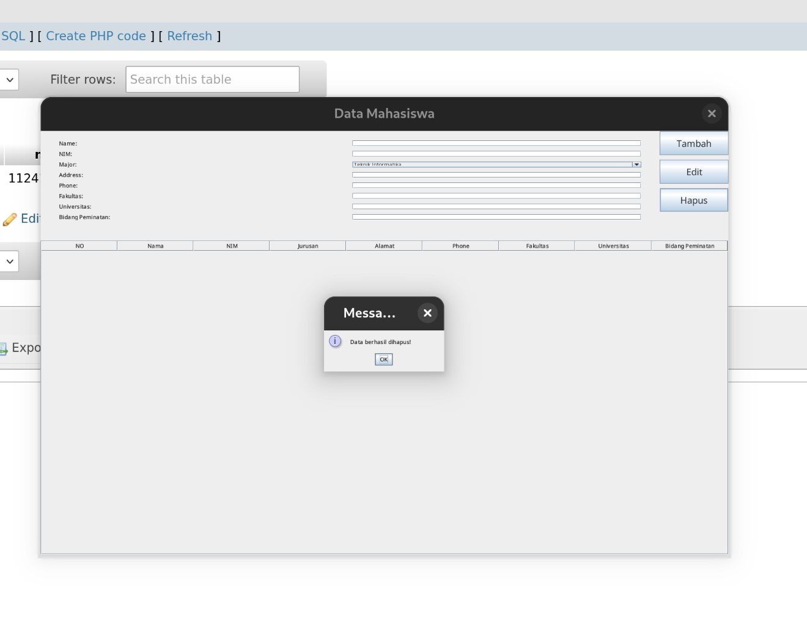

# Pemrograman Berorientasi Objek

## Praktikum Modul 10

**Disusun oleh:**  
**Nama:** Gian Alharitz Ueldy Secondri  
**NIM:** 11241033

---

### Tugas dan Deskripsi Singkat

1. Dari program CRUD Data Mahasiswa yang telah anda buat, tambahkanlah data :

   - Fakultas
   - Universitas
   - Bidang Peminatan

Penambahan data pada aplikasi CRUD `Data_Mahasiswa` meliputi:

- Penambahan kolom fakultas, universitas, bidang_peminatan pada database melalui http://localhost/phpmyadmin/
- Penambahan label Fakultas, Universitas, Bidang Peminatan pada GUI Java Jframe
- Penambahan jTextField5, jTextField6, jTextField7 untuk masing-masing data Fakultas, Universitas, dan Bidang Peminatan
- Penambahan 3 kolom tabel untuk Fakultas, Universitas, dan Bidang Peminatan
- serta penyesuaian coding dan penambahan coding-coding tertentu yang
  diperlukan.

---

## Pembahasan

#### `Main.java`

```java
// Deklarasi kelas utama
public class Main {
  // Kelas utama untuk menjalankan program
  public static void main(String[] args) {

    new StudentRecord(); // Membuat objek baru dari kelas StudentRecord
  }
}
```

#### `Conn.java`

```java
// Import statement untuk kelas-kelas yang diperlukan
import java.sql.Connection;
import java.sql.DriverManager;
import java.sql.SQLException;

// Kelas Conn digunakan untuk mengatur koneksi ke database MySQL
public class Conn {

  // Variabel statis untuk menyimpan objek koneksi
  private static Connection mysqlconfig;

  // Method statis untuk mendapatkan koneksi database
  public static Connection db() throws SQLException {
    try {
      // Memuat (load) driver JDBC MySQL
      Class.forName("com.mysql.cj.jdbc.Driver");

      // URL koneksi ke database (ganti 'db_mahasiswa' jika nama DB kamu beda)
      String url = "jdbc:mysql://localhost:3306/db_mahasiswa";
      // Username untuk login ke MySQL (ganti jika kamu pakai user lain)
      String user = "root";
      // Password MySQL (kosongkan kalau tidak pakai password)
      String password = "root";

      // Membuat koneksi ke database
      mysqlconfig = DriverManager.getConnection(url, user, password);
      System.out.println("Koneksi Berhasil"); // Tampilkan pesan jika berhasil

    } catch (SQLException e) {
      // Menangani kesalahan koneksi database
      System.err.println("Koneksi Gagal: " + e.getMessage());
    } catch (ClassNotFoundException e) {
      // Menangani jika driver JDBC tidak ditemukan
      System.err.println("Driver tidak ditemukan: " + e.getMessage());
    }

    // Mengembalikan objek koneksi
    return mysqlconfig;
  }
}
```

#### `StudentRecord.java`

```java
// Import statement untuk kelas-kelas yang diperlukan
import javax.swing.*;
import javax.swing.table.DefaultTableModel;
import java.awt.*;
import java.awt.event.ActionEvent;
import java.awt.event.ActionListener;
import java.sql.Connection;
import java.sql.PreparedStatement;
import java.sql.ResultSet;

// Kelas StudentRecord digunakan untuk menampilkan dan mengelola data mahasiswa
public class StudentRecord extends JFrame {

  // Variabel untuk komponen GUI
  private JTable table;
  // Model tabel untuk menyimpan data mahasiswa
  private DefaultTableModel model;
  // Variabel untuk menyimpan data mahasiswa
  private JTextField nameField, nimField, addressField, phoneField, fakultasField, universitasField,
      bidangPeminatanField;
  // ComboBox untuk jurusan
  private JComboBox<String> majorComboBox;

  // Konstruktor kelas StudentRecord
  public StudentRecord() {
    // Memanggil method untuk menginisialisasi komponen GUI
    initComponents();
  }

  // Method untuk memuat komponen tabel
  private JTable loadTableComponent() {
    // Membuat tabel baru
    table = new JTable();
    // Mengatur ukuran tabel
    model = new DefaultTableModel(new Object[] {
        "NO",
        "Nama",
        "NIM",
        "Jurusan",
        "Alamat",
        "Phone",
        "Fakultas",
        "Universitas",
        "Bidang Peminatan"
    }, 0);
    // Mengatur model tabel
    table.setModel(model);
    // Mengatur ukuran kolom tabel
    table.setFont(new Font("Arial", Font.PLAIN, 12));
    // Mengatur ukuran lebar kolom tabel
    table.setRowHeight(30);
    // Mengatur ukuran lebar kolom tabel
    table.getTableHeader().setFont(new Font("Arial", Font.BOLD, 12));

    setTableClickListener(); // Set listener untuk klik pada tabel

    table.setSelectionMode(ListSelectionModel.SINGLE_SELECTION);
    refreshTableData(); // Load data saat pertama kali
    return table;
  }

  // Method untuk memuat data dari baris yang dipilih di tabel dan menampilkannya
  // ke field input
  private void loadSelectedRowData() {
    // Mengambil index baris yang sedang dipilih oleh user di tabel
    int selectedRow = table.getSelectedRow();

    // Jika tidak ada baris yang dipilih (misalnya user belum klik apa pun), keluar
    // dari method
    if (selectedRow == -1) {
      return;
    }

    // Mengisi nilai dari kolom-kolom di baris yang dipilih ke dalam field input
    // form
    nameField.setText(model.getValueAt(selectedRow, 1).toString()); // Nama Mahasiswa
    nimField.setText(model.getValueAt(selectedRow, 2).toString()); // NIM
    majorComboBox.setSelectedItem(model.getValueAt(selectedRow, 3).toString()); // Jurusan
    addressField.setText(model.getValueAt(selectedRow, 4).toString()); // Alamat
    phoneField.setText(model.getValueAt(selectedRow, 5).toString()); // No HP
    fakultasField.setText(model.getValueAt(selectedRow, 6).toString()); // Fakultas
    universitasField.setText(model.getValueAt(selectedRow, 7).toString()); // Universitas
    bidangPeminatanField.setText(model.getValueAt(selectedRow, 8).toString()); // Bidang Peminatan
  }

  // Method untuk menambahkan event listener saat tabel diklik
  private void setTableClickListener() {
    // Menambahkan listener untuk menangani klik mouse pada tabel
    table.addMouseListener(new java.awt.event.MouseAdapter() {

      // Method yang dijalankan ketika mouse diklik
      public void mouseClicked(java.awt.event.MouseEvent evt) {
        // Memanggil method untuk memuat data dari baris yang dipilih ke dalam form
        loadSelectedRowData();
      }
    });
  }

  // Method untuk memuat data dari database ke dalam tabel
  // Method untuk memperbarui data tabel dari database
  private void refreshTableData() {
    // Menghapus semua baris yang ada di model tabel
    model.setRowCount(0);
    try {
      // Query SQL untuk mengambil semua data mahasiswa
      String sql = "SELECT * FROM mahasiswa";
      // Membuat koneksi ke database
      Connection conn = Conn.db();
      // Membuat prepared statement
      PreparedStatement pstmt = conn.prepareStatement(sql);
      // Mengeksekusi query dan mendapatkan hasil
      ResultSet rs = pstmt.executeQuery();

      // Loop melalui setiap baris hasil query
      while (rs.next()) {
        // Menambahkan baris baru ke model tabel dengan data dari database
        model.addRow(new Object[] {
            model.getRowCount() + 1, // Nomor urut
            rs.getString("nama"), // Nama mahasiswa
            rs.getString("nim"), // NIM mahasiswa
            rs.getString("jurusan"), // Jurusan
            rs.getString("alamat"), // Alamat
            rs.getString("no_telpon"), // Nomor telepon
            rs.getString("fakultas"), // Fakultas
            rs.getString("universitas"), // Universitas
            rs.getString("bidang_peminatan") // Bidang peminatan
        });
      }
      // Menutup resources
      rs.close();
      pstmt.close();
      conn.close();
    } catch (Exception e) {
      // Menampilkan pesan error jika terjadi exception
      JOptionPane.showMessageDialog(null, "Error: " + e.getMessage(), "Error", JOptionPane.ERROR_MESSAGE);
    }
  }

  // Method untuk mengosongkan semua field input
  private void clearFields() {
    nameField.setText("");
    nimField.setText("");
    addressField.setText("");
    phoneField.setText("");
    majorComboBox.setSelectedIndex(0); // Reset combo box ke index pertama
    fakultasField.setText("");
    universitasField.setText("");
    bidangPeminatanField.setText("");
  }

  // Method untuk membuat komponen form mahasiswa
  private JPanel studentFormComponent() {
    // Panel utama dengan layout grid 9 baris 2 kolom
    JPanel formPanel = new JPanel(new GridLayout(9, 2, 10, 10)); // spacing antar komponen
    formPanel.setPreferredSize(new Dimension(600, 200));

    /* Komponen untuk input Nama */
    JLabel nameLabel = new JLabel("Name:");
    nameLabel.setFont(new Font("Arial", Font.BOLD, 12));

    /* Field input Nama */
    nameField = new JTextField();
    nameField.setFont(new Font("Arial", Font.PLAIN, 12));
    nameField.setPreferredSize(new Dimension(300, 40)); // lebar 300px, tinggi 40px

    /* Komponen untuk input NIM */
    JLabel nimLabel = new JLabel("NIM:");
    nimLabel.setFont(new Font("Arial", Font.BOLD, 12));

    /* Field input NIM */
    nimField = new JTextField();
    nimField.setFont(new Font("Arial", Font.PLAIN, 12));
    nimField.setPreferredSize(new Dimension(300, 40));

    /* Komponen untuk input Jurusan */
    JLabel majorLabel = new JLabel("Major:");
    majorLabel.setFont(new Font("Arial", Font.BOLD, 12));

    /* Combo box untuk memilih Jurusan */
    String[] majors = { "Teknik Informatika", "Sistem Informasi", "Teknik Komputer" };
    majorComboBox = new JComboBox<String>(majors);
    majorComboBox.setFont(new Font("Arial", Font.PLAIN, 12));
    majorComboBox.setPreferredSize(new Dimension(300, 40));

    /* Komponen untuk input Alamat */
    JLabel addressLabel = new JLabel("Address:");
    addressLabel.setFont(new Font("Arial", Font.BOLD, 12));

    /* Field input Alamat */
    addressField = new JTextField();
    addressField.setFont(new Font("Arial", Font.PLAIN, 12));
    addressField.setPreferredSize(new Dimension(300, 40));

    /* Komponen untuk input Telepon */
    JLabel phoneLabel = new JLabel("Phone:");
    phoneLabel.setFont(new Font("Arial", Font.BOLD, 12));

    /* Field input Telepon */
    phoneField = new JTextField();
    phoneField.setFont(new Font("Arial", Font.PLAIN, 12));
    phoneField.setPreferredSize(new Dimension(300, 40));

    /* Komponen untuk input Fakultas */
    JLabel fakultasLabel = new JLabel("Fakultas:");
    fakultasLabel.setFont(new Font("Arial", Font.BOLD, 12));

    /* Field input Fakultas */
    fakultasField = new JTextField();
    fakultasField.setFont(new Font("Arial", Font.PLAIN, 12));
    fakultasField.setPreferredSize(new Dimension(300, 40));

    /* Komponen untuk input Universitas */
    JLabel universitasLabel = new JLabel("Universitas:");
    universitasLabel.setFont(new Font("Arial", Font.BOLD, 12));

    /* Field input Universitas */
    universitasField = new JTextField();
    universitasField.setFont(new Font("Arial", Font.PLAIN, 12));
    universitasField.setPreferredSize(new Dimension(300, 40));

    /* Komponen untuk input Bidang Peminatan */
    JLabel bidangPeminatanLabel = new JLabel("Bidang Peminatan:");
    bidangPeminatanLabel.setFont(new Font("Arial", Font.BOLD, 12));

    /* Field input Bidang Peminatan */
    bidangPeminatanField = new JTextField();
    bidangPeminatanField.setFont(new Font("Arial", Font.PLAIN, 12));
    bidangPeminatanField.setPreferredSize(new Dimension(300, 40));

    // Menambahkan semua komponen ke panel form
    formPanel.add(nameLabel);
    formPanel.add(nameField);
    formPanel.add(nimLabel);
    formPanel.add(nimField);
    formPanel.add(majorLabel);
    formPanel.add(majorComboBox);
    formPanel.add(addressLabel);
    formPanel.add(addressField);
    formPanel.add(phoneLabel);
    formPanel.add(phoneField);
    formPanel.add(fakultasLabel);
    formPanel.add(fakultasField);
    formPanel.add(universitasLabel);
    formPanel.add(universitasField);
    formPanel.add(bidangPeminatanLabel);
    formPanel.add(bidangPeminatanField);

    // Panel wrapper untuk memberikan padding
    JPanel wrapperPanel = new JPanel(new BorderLayout());
    wrapperPanel.setBorder(BorderFactory.createEmptyBorder(20, 40, 20, 40)); // top, left, bottom, right
    wrapperPanel.add(formPanel, BorderLayout.CENTER);

    return wrapperPanel;
  }

  // Method untuk membuat komponen tombol aksi
  private JPanel buttonComponent() {
    // Panel untuk tombol dengan layout grid 4 baris 1 kolom
    JPanel buttonPanel = new JPanel(new GridLayout(4, 1, 10, 10));
    buttonPanel.setPreferredSize(new Dimension(150, 200));

    // Membuat tombol-tombol aksi
    JButton addButton = new JButton("Tambah");
    JButton editButton = new JButton("Edit");
    JButton deleteButton = new JButton("Hapus");

    // Mengatur font tombol
    addButton.setFont(new Font("Arial", Font.PLAIN, 20));
    editButton.setFont(new Font("Arial", Font.PLAIN, 20));
    deleteButton.setFont(new Font("Arial", Font.PLAIN, 20));

    // Action listener untuk tombol Tambah
    addButton.addActionListener(new ActionListener() {
      public void actionPerformed(ActionEvent evt) {
        // Mengambil nilai dari semua field input
        String name = nameField.getText();
        String nim = nimField.getText();
        String major = (String) majorComboBox.getSelectedItem();
        String address = addressField.getText();
        String phone = phoneField.getText();
        String fakultas = fakultasField.getText();
        String universitas = universitasField.getText();
        String bidangPeminatan = bidangPeminatanField.getText();

        // Validasi field wajib diisi
        if (name.isEmpty() ||
            nim.isEmpty() ||
            address.isEmpty() ||
            phone.isEmpty() ||
            fakultas.isEmpty() ||
            universitas.isEmpty() ||
            bidangPeminatan.isEmpty()) {
          JOptionPane.showMessageDialog(null, "Please fill in all fields", "Error", JOptionPane.ERROR_MESSAGE);
          return;
        }

        try {
          // Query SQL untuk insert data
          String sql = "INSERT INTO mahasiswa (nama, nim, jurusan, alamat, no_telpon, fakultas, universitas, bidang_peminatan) VALUES (?, ?, ?, ?, ?, ?, ?, ?)";
          Connection conn = Conn.db();
          PreparedStatement pstmt = conn.prepareStatement(sql);
          // Mengisi parameter query
          pstmt.setString(1, name);
          pstmt.setString(2, nim);
          pstmt.setString(3, major);
          pstmt.setString(4, address);
          pstmt.setString(5, phone);
          pstmt.setString(6, fakultas);
          pstmt.setString(7, universitas);
          pstmt.setString(8, bidangPeminatan);

          // Eksekusi query
          pstmt.executeUpdate();
          pstmt.close();
          conn.close();

          // Refresh tabel dan kosongkan field
          refreshTableData();
          clearFields();
          JOptionPane.showMessageDialog(null, "Data berhasil ditambahkan!");
        } catch (Exception ex) {
          JOptionPane.showMessageDialog(null, "Error: " + ex.getMessage(), "Error", JOptionPane.ERROR_MESSAGE);
        }
      }
    });

    // Action listener untuk tombol Edit
    editButton.addActionListener(new ActionListener() {
      public void actionPerformed(ActionEvent evt) {
        // Memeriksa apakah ada baris yang dipilih di tabel
        int selectedRow = table.getSelectedRow();
        if (selectedRow == -1) {
          JOptionPane.showMessageDialog(null, "Pilih data yang ingin diedit", "Peringatan",
              JOptionPane.WARNING_MESSAGE);
          return;
        }
        // Mengambil NIM dari baris yang dipilih
        String nim = model.getValueAt(selectedRow, 2).toString();

        try {
          // Query SQL untuk update data
          String sql = "UPDATE mahasiswa SET nama=?, jurusan=?, alamat=?, no_telpon=?, fakultas=?, universitas=?, bidang_peminatan=? WHERE nim=?";
          Connection conn = Conn.db();
          PreparedStatement pstmt = conn.prepareStatement(sql);
          // Mengisi parameter query
          pstmt.setString(1, nameField.getText());
          pstmt.setString(2, (String) majorComboBox.getSelectedItem());
          pstmt.setString(3, addressField.getText());
          pstmt.setString(4, phoneField.getText());
          pstmt.setString(5, fakultasField.getText());
          pstmt.setString(6, universitasField.getText());
          pstmt.setString(7, bidangPeminatanField.getText());
          pstmt.setString(8, nim);

          // Eksekusi query
          pstmt.executeUpdate();
          pstmt.close();
          conn.close();

          // Refresh tabel dan kosongkan field
          refreshTableData();
          clearFields();
          JOptionPane.showMessageDialog(null, "Data berhasil diupdate!");
        } catch (Exception ex) {
          JOptionPane.showMessageDialog(null, "Error: " + ex.getMessage(), "Error", JOptionPane.ERROR_MESSAGE);
        }
      }
    });

    // Action listener untuk tombol Hapus
    deleteButton.addActionListener(new ActionListener() {
      public void actionPerformed(ActionEvent evt) {
        // Memeriksa apakah ada baris yang dipilih di tabel
        int selectedRow = table.getSelectedRow();
        if (selectedRow == -1) {
          JOptionPane.showMessageDialog(null, "Pilih data yang ingin dihapus", "Peringatan",
              JOptionPane.WARNING_MESSAGE);
          return;
        }

        // Mengambil NIM dari baris yang dipilih
        String nim = model.getValueAt(selectedRow, 2).toString();
        try {
          // Query SQL untuk delete data
          String sql = "DELETE FROM mahasiswa WHERE nim=?";
          Connection conn = Conn.db();
          PreparedStatement pstmt = conn.prepareStatement(sql);
          pstmt.setString(1, nim);

          // Eksekusi query
          pstmt.executeUpdate();
          pstmt.close();
          conn.close();

          // Refresh tabel dan kosongkan field
          refreshTableData();
          clearFields();
          JOptionPane.showMessageDialog(null, "Data berhasil dihapus!");
        } catch (Exception ex) {
          JOptionPane.showMessageDialog(null, "Error: " + ex.getMessage(), "Error", JOptionPane.ERROR_MESSAGE);
        }
      };
    });

    // Menambahkan tombol ke panel
    buttonPanel.add(addButton);
    buttonPanel.add(editButton);
    buttonPanel.add(deleteButton);

    return buttonPanel;
  }

  // Method untuk inisialisasi komponen utama
  private void initComponents() {
    // Pengaturan dasar JFrame
    setTitle("Data Mahasiswa");
    setSize(1500, 1000);
    setMinimumSize(new Dimension(1000, 700));
    setDefaultCloseOperation(JFrame.EXIT_ON_CLOSE);
    setLocationRelativeTo(null);
    setLayout(new BorderLayout());

    // Panel atas berisi form dan tombol
    JPanel topPanel = new JPanel(new BorderLayout());
    topPanel.add(studentFormComponent(), BorderLayout.CENTER);
    topPanel.add(buttonComponent(), BorderLayout.EAST);
    add(topPanel, BorderLayout.NORTH);

    // Scroll pane untuk tabel
    JScrollPane scrollPane = new JScrollPane(loadTableComponent());
    scrollPane.setPreferredSize(new Dimension(1000, 400));
    add(scrollPane, BorderLayout.CENTER);

    // Menampilkan frame
    setVisible(true);
  }

  // Method main untuk menjalankan aplikasi
  public static void main(String[] args) {
    new StudentRecord();
  }
}
```

#### Output






