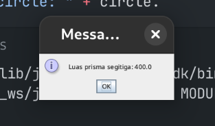

# Pemrograman Berorientasi Objek

## Praktikum Modul 2

**Disusun oleh:**  
**Nama:** Gian Alharitz Ueldy Secondri  
**NIM:** 11241033

---

### Tugas dan Deskripsi Singkat

1. Dengan menggunakan **3 jenis input**:

   - `Scanner`
   - `BufferedReader`
   - `JOptionPane`

   Buatlah program sederhana untuk menghitung:

   - Keliling lingkaran
   - Luas trapesium
   - Luas permukaan prisma segitiga

---

## Pembahasan

#### `Main.java`

```java
// Import class-class yang dibutuhkan untuk input dari pengguna
import java.io.BufferedReader;
import java.io.InputStreamReader;
import java.util.Scanner;
import javax.swing.JOptionPane;

public class Main {
  public static void main(String[] args) {
    // Membuat objek Scanner untuk input dari console (terminal)
    Scanner scanner = new Scanner(System.in);

    // Membuat objek BufferedReader untuk input dari console (juga terminal, tapi dengan cara berbeda)
    BufferedReader reader = new BufferedReader(new InputStreamReader(System.in));

    try {
      // =========================
      // 1. Keliling Lingkaran (menggunakan Scanner)
      // =========================
      System.out.println("Enter the radius of the circle: ");
      double radius = scanner.nextDouble(); // Mengambil inputan jari-jari dari user
      Circle circle = new Circle(radius); // Membuat objek Circle dengan jari-jari yang diinputkan
      System.out.println("Circumference of the circle: " + circle.calculateCircumference()); // Cetak hasil keliling lingkaran

      // =========================
      // 2. Luas Trapesium (menggunakan BufferedReader)
      // =========================
      System.out.println("Masukkan panjang alas atas trapesium: ");
      double upperBase = Double.parseDouble(reader.readLine()); // Input alas atas

      System.out.println("Masukkan panjang alas bawah trapesium: ");
      double lowerBase = Double.parseDouble(reader.readLine()); // Input alas bawah

      System.out.println("Masukkan tinggi trapesium: ");
      double height = Double.parseDouble(reader.readLine()); // Input tinggi

      Trapezoid trapezoid = new Trapezoid(upperBase, lowerBase, height); // Membuat objek Trapezoid
      System.out.println("Luas trapesium: " + trapezoid.calculateArea()); // Cetak hasil luas trapesium

      // =========================
      // 3. Luas Prisma Segitiga (menggunakan JOptionPane)
      // =========================
      // Input menggunakan dialog GUI
      double baseTriangle = Double.parseDouble(JOptionPane.showInputDialog("Masukkan alas segitiga: "));
      double triangleHeight = Double.parseDouble(JOptionPane.showInputDialog("Masukkan tinggi segitiga: "));
      double prismHeight = Double.parseDouble(JOptionPane.showInputDialog("Masukkan tinggi prisma segitiga: "));

      TriangularPrism triangularPrism = new TriangularPrism(baseTriangle, triangleHeight, prismHeight); // Membuat objek Prisma Segitiga
      JOptionPane.showMessageDialog(null, "Luas prisma segitiga: " + triangularPrism.calculateSurfaceArea()); // Tampilkan hasilnya di pop-up

    } catch (Exception e) {
      // Menangkap error saat input tidak sesuai (misalnya user input huruf)
      System.out.println("Error: " + e.getMessage());
    } finally {
      // Menutup scanner untuk mencegah memory leak
      scanner.close();
    }
  }
}

```

#### `Circle.java`

```java
// Kelas Circle
public class Circle {

  // Variabel untuk menyimpan lebar dan tinggi persegi panjang
  private double radius;

  // Constructor: digunakan untuk menginisialisasi nilai radius saat objek dibuat
  public Circle(double radius){
    this.radius = radius;
  }

  // Method untuk menghitung keliling lingkaran
  // Rumus: 2 * π * r
  public double calculateCircumference() {
    return 2 * Math.PI * radius;
  }

  // Method untuk menghitung luas lingkaran
  // Rumus: π * r^2
  public double calculateArea() {
    return Math.PI * radius * radius;
  }
}
```

#### `Trapezium.java`

```java
// Kelas Trapezium
public class Trapezoid {

  // Variabel untuk menyimpan panjang alas atas, alas bawah, dan tinggi
  private double upperBase;
  private double lowerBase;
  private double height;

  // Constructor: digunakan untuk menginisialisasi panjang alas atas, alas bawah, dan tinggi saat objek dibuat
  public Trapezoid(double upperBase, double lowerBase, double height){
    this.upperBase = upperBase; // alas atas
    this.lowerBase = lowerBase; // alas bawah
    this.height = height; // tinggi
  }


  // Method untuk menghitung luas trapesium
  // Rumus: ½ × (alas atas + alas bawah) × tinggi
  public double calculateArea(){
    return 0.5 * (upperBase + lowerBase) * height;
  }

}
```

#### `TriangularPrism.java`

```java
// Kelas Prisma Segitiga
public class TriangularPrism {

  // Variable untuk menyimpan alas segitiga, tinggi segitiga, dan tinggi prisma
  private double triangleBase;
  private double triangleHeight;
  private double prismHeight;

  // Constructor: digunakan untuk menginisialisasi alas segitiga, tinggi segitiga, dan tinggi prisma
  public TriangularPrism(double triangleBase, double triangleHeight, double prismHeight){
    this.triangleBase = triangleBase;
    this.triangleHeight = triangleHeight;
    this.prismHeight = prismHeight;
  }

  // Method untuk menghitung luas salah satu segitiga alas
  // Rumus luas segitiga: ½ × alas × tinggi
  public double calculateTriangleArea(){
    return 0.5 * triangleBase * triangleHeight;
  }

  // Method untuk menghitung luas permukaan prisma segitiga
  // Rumus: 2 × luas alas + luas ketiga sisi tegak
  public double calculateSurfaceArea(){
    double triangleArea = calculateTriangleArea();
    return 2 * triangleArea + (3 * triangleBase * prismHeight);
  }

}
```

#### Output



