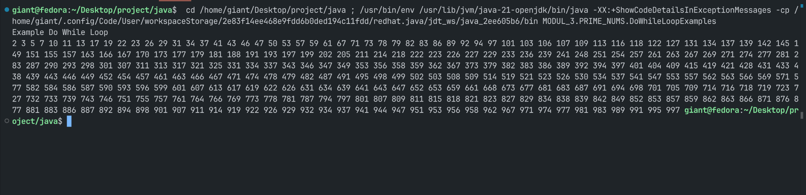
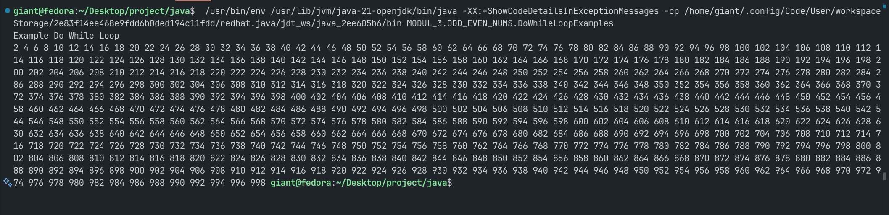

# Pemrograman Berorientasi Objek

## Praktikum Modul 3

**Disusun oleh:**  
**Nama:** Gian Alharitz Ueldy Secondri  
**NIM:** 11241033

---

### Tugas dan Deskripsi Singkat

1. Buatlah program dengan menggunakan **for-loop**, **while-loop**, **do-while** loop untuk
   mencari :
   - Bilangan prima antara 1-1000
   - Bilangan ganjil dan genap antara 1-1000

---

## Pembahasan

### Bilangan Prima 1-1000

#### `ForLoopExamples.java`

```java
// Kelas utama dengan nama ForLoopExamples
public class ForLoopExamples {

  // Fungsi main - titik awal dari program
  public static void main(String[] args) {

    // Menampilkan teks "Example for loop" ke konsol
    System.out.println("Example For Loop");

    // Deklarasi variable max: tipe data integer sebagai batas maksimum angka yang mau dicek, yaitu 1000
    int max = 1000;

    // Mulai perulangan dari angka 1 sampai 1000
    for (int i = 1; i <= max; i++) {

      // Deklarasi variable isPrime: tipe data boolean
      boolean isPrime = true;

      // Cek apakah angka i punya pembagi selain 1 dan dirinya sendiri
      // Cek dari 2 sampai akar kuadrat dari i
      for (int j = 2; j <= Math.sqrt(i); j++) {

        // Jika i bisa dibagi habis oleh j, maka i bukan bilangan prima
        if (i % j == 0) {
          isPrime = false; // Mengubah nilai isPrime menjadi false
          break; // Langsung keluar dari loop karena bukan prima
        }
      }

      // Mengecek apakah bilangan tersebut prima dan bukan 1 (karena 1 bukan bilangan prima)
      if (isPrime && i > 1) {

        // Tampilkan angka i karena bilangan prima
        System.out.print(i + " ");
      }
    }
  }
}
```

#### `WhileLoopExamples.java`

```java
// Kelas utama dengan nama WhileLoopExamples
public class WhileLoopExamples {

   // Fungsi main - titik awal dari program
  public static void main(String[] args) {

    // Menampilkan judul atau penanda awal eksekusi program
    System.out.println("Example While Loop");

    // Inisialisasi nilai maksimum batas pencarian bilangan prima
    int max = 1000;

    // Variabel 'current' digunakan untuk menyimpan angka yang sedang diperiksa
    int current = 1;

    // Variabel 'checker' digunakan untuk memeriksa apakah current memiliki pembagi selain 1 dan dirinya sendiri
    int checker = 2;

    // Struktur perulangan while akan berjalan selama nilai 'current' kurang dari 'max'
    while (current < max) {

      // Jika 'current' kurang dari 2, maka secara definisi bukan bilangan prima
      // Langsung lanjut ke angka berikutnya
      if (current < 2) {
        current++;
      }

      // Jika nilai 'checker' sudah melebihi akar dari current,
      // maka dapat disimpulkan bahwa current adalah bilangan prima
      if (checker > Math.sqrt(current)) {
        // Reset nilai 'checker' kembali ke 2 untuk digunakan pada angka berikutnya
        checker = 2;

        // Menampilkan nilai 'current' karena telah dikonfirmasi sebagai bilangan prima
        System.out.print(current + " ");

        // Lanjut ke angka berikutnya
        current++;
      }

      // Jika 'current' habis dibagi oleh 'checker', maka 'current' bukan bilangan prima
      // Langsung lanjut ke angka berikutnya tanpa mencetak
      else if (current % checker == 0) {
        current++;
      }

      // Jika 'current' tidak habis dibagi oleh 'checker',
      // maka nilai 'checker' akan ditambah satu untuk melanjutkan proses pengecekan
      else {
        checker++;
      }
    }

  }
}
```

#### `DoWhileLoopExamples.java`

```java
// Mengimpor fungsi sqrt (akar kuadrat) dari kelas Math agar dapat digunakan secara langsung
import static java.lang.Math.sqrt;

// Kelas utama dengan nama DoWhileLoopExamples
public class DoWhileLoopExamples {

  // Fungsi main - titik awal dari program
  public static void main(String[] args) {
    // Menampilkan penanda bahwa program menggunakan do-while loop
    System.out.println("Example Do While Loop");

    // Variabel 'max' untuk menentukan batas maksimum bilangan yang akan diperiksa
    int max = 1000;

    // Variabel 'current' menyimpan angka yang sedang diperiksa
    int current = 1;

    // Variabel 'checker' digunakan untuk memeriksa apakah current memiliki faktor pembagi
    int checker = 2;

    // Struktur do-while akan terus dijalankan selama current < max
    do {

      // Jika angka kurang dari 2, maka langsung lanjut ke angka berikutnya
      if (current < 2) {
        current++;
      }

      // Jika nilai checker melebihi akar kuadrat dari current, maka diasumsikan current adalah bilangan prima
      if (checker > sqrt(current)) {
        checker = 2; // Reset nilai checker untuk angka berikutnya
        System.out.print(current + " "); // Cetak bilangan prima
        current++; // Lanjut ke angka berikutnya
      }

      // Jika current habis dibagi checker (bukan bilangan prima), lanjut ke angka berikutnya
      else if (current % checker == 0) {
        current++;
      }

      // Jika belum bisa dipastikan bukan bilangan prima, lanjut periksa dengan pembagi selanjutnya
      else {
        checker++;
      }

    } while (current < max); // Ulangi selama current masih kurang dari 1000
  }
}
```

#### Output



#### Bilangan Ganjil dan Genap 1-1000

#### `ForLoopExamples.java`

```java
// Kelas utama dengan nama ForLoopExamples
public class ForLoopExamples {

  // Fungsi main - titik awal dari program
  public static void main(String[] args) {

    // Menampilkan judul atau penanda bahwa program menggunakan perulangan for
    System.out.println("Example For Loop");

    // Variabel 'max' untuk menentukan batas maksimum bilangan yang akan diperiksa
    int max = 1000;

    // Perulangan for digunakan untuk menelusuri setiap angka dari 1 sampai dengan 1000
    for (int current = 1; current <= max; current++) {

      // Mengecek apakah angka saat ini: 'current' adalah bilangan genap
      if (current % 2 == 0) {

        // Jika iya, cetak angka dan informasi bahwa itu bilangan genap
        System.out.println(current + " Genap");
      } else {

        // Jika tidak (berarti ganjil), cetak angka dan informasi bahwa itu bilangan ganjil
        System.out.println(current + " Ganjil");
      }
    }
  }
}

```

#### `WhileLoopExamples.java`

```java
// Kelas utama dengan nama WhileLoopExamples
public class WhileLoopExamples {

  // Fungsi main - titik awal dari program
  public static void main(String[] args) {

    // Menampilkan teks penanda bahwa program ini menggunakan perulangan while
    System.out.println("Example While Loop");

    // Variabel 'max' untuk menentukan batas maksimum bilangan yang akan diperiksa
    int max = 1000;

    // Inisialisasi variabel 'current' dengan nilai awal 1
    int current = 1;

    // Melakukan perulangan selama 'current' kurang dari atau sama dengan 1000
    while (current <= max) {
      // Mengecek apakah angka saat ini adalah bilangan genap
      if (current % 2 == 0) {
        // Jika ya, cetak angka tersebut dengan keterangan "Genap"
        System.out.println(current + " Genap");
      } else {
        // Jika tidak, maka angka tersebut ganjil, cetak dengan keterangan "Ganjil"
        System.out.println(current + " Ganjil");
      }
      // Menambahkan nilai 'current' untuk memeriksa angka selanjutnya
      current++;
    }

  }
}

```

#### `DoWhileLoopExamples.java`

```java
// Kelas utama dengan nama DoWhileLoopExamples
public class DoWhileLoopExamples {

  // Fungsi main - titik awal dari program
  public static void main(String[] args) {

    // Menampilkan teks penanda bahwa program ini menggunakan perulangan do-while
    System.out.println("Example Do While Loop");

    // Menentukan batas maksimum angka yang akan diperiksa
    int max = 1000;

    // Inisialisasi variabel current dengan nilai awal 1
    int current = 1;

    // Perulangan do-while akan mengeksekusi blok kode terlebih dahulu sebelum melakukan pengecekan kondisi
    do {
      // Mengecek apakah angka saat ini merupakan bilangan genap
      if (current % 2 == 0) {
        // Jika ya, cetak angka tersebut dengan spasi
        System.out.print(current + " ");
      }
      // Menambah nilai current untuk memeriksa angka berikutnya
      current++;
    } while (current < max); // Perulangan akan terus berjalan selama current kurang dari max
  }
}
```

#### Output


