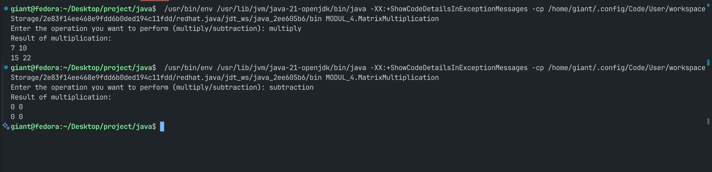

# Pemrograman Berorientasi Objek

## Praktikum Modul 4

**Disusun oleh:**  
**Nama:** Gian Alharitz Ueldy Secondri  
**NIM:** 11241033

---

### Tugas dan Deskripsi Singkat

1. Buatlah program Java sederhana yang dapat menghitung perkalian dan pengurangan
   antara matriks X dan Y yang memiliki ordo 2x2. Gunakan switch-case dalam pemilihan
   perkalian dan pengurangan matriks.

---

## Pembahasan

#### `MatrixMultiplication.java`

```java
package MODUL_4; // Menentukan package dari kelas ini

import java.util.Scanner; // Mengimpor kelas Scanner untuk input dari pengguna

public class MatrixMultiplication {

  public static void main(String[] args) {
    // Inisialisasi dua buah matriks 2x2 bernama matrixX dan matrixY
    int[][] matrixX = {
        { 1, 2 },
        { 3, 4 },
    };

    int[][] matrixY = {
        { 1, 2 },
        { 3, 4 },
    };

    // Menampilkan prompt kepada pengguna untuk memilih operasi
    System.err.print("Enter the operation you want to perform (multiply/subtraction): ");
    Scanner input = new Scanner(System.in); // Membuat objek Scanner untuk membaca input dari pengguna

    // Struktur switch-case digunakan untuk memilih operasi berdasarkan input
    switch (input.nextLine()) {
      case "multiply":
        // Menyediakan array kosong untuk menyimpan hasil perkalian matriks
        // Ukuran hasil perkalian matriks adalah baris matrixX × kolom matrixY
        int[][] resultMultiply = new int[matrixX.length][matrixY[0].length];

        // Tiga perulangan digunakan untuk menghitung hasil perkalian matriks
        // Iterasi baris matriks X
        for (int i = 0; i < matrixX.length; i++) {

          // Iterasi kolom matriks Y
          for (int j = 0; j < matrixY[0].length; j++) {

            // Iterasi untuk menghitung elemen hasil
            for (int k = 0; k < matrixX[0].length; k++) {

              // Menghitung hasil perkalian elemen matriks satu per satu
              // Hasil perkalian elemen matriks X dan Y disimpan di resultMultiply
              resultMultiply[i][j] += matrixX[i][k] * matrixY[k][j];
            }
          }
        }

        // Menampilkan hasil dari perkalian matriks
        System.out.println("Result of multiplication:");

        // Dua perulangan digunakan untuk mencetak hasil perkalian matriks
        // Iterasi baris matriks X
        for (int i = 0; i < resultMultiply.length; i++) {

          // Iterasi baris matriks X
          for (int j = 0; j < resultMultiply[i].length; j++) {

            // Mencetak elemen hasil perkalian matriks
            System.out.print(resultMultiply[i][j] + " ");
          }

          // Pindah ke baris baru setelah mencetak satu baris matriks
          System.out.println();
        }
        break;

      case "subtraction":
        // Menyediakan array kosong untuk menyimpan hasil pengurangan matriks
        // Ukuran hasil pengurangan matriks adalah baris matrixX × kolom matrixY
        int[][] resultSubstraction = new int[matrixX.length][matrixY[0].length];

        // Menghitung pengurangan elemen matriks satu per satu
        // Iterasi baris matriks X
        for (int i = 0; i < matrixX.length; i++) {

          // Iterasi kolom matriks Y
          for (int j = 0; j < matrixY[0].length; j++) {

            // Menghitung hasil pengurangan elemen matriks satu per satu
            // Hasil pengurangan elemen matriks X dan Y disimpan di resultSubstraction
            // Menggunakan operator pengurangan (-) untuk menghitung hasil
            resultSubstraction[i][j] = matrixX[i][j] - matrixY[i][j];
          }
        }

        // Menampilkan hasil dari perkalian matriks
        System.out.println("Result of multiplication:");

        // Dua perulangan digunakan untuk mencetak hasil perkalian matriks
        // Iterasi baris matriks X
        for (int i = 0; i < resultSubstraction.length; i++) {

          // Iterasi baris matriks X
          for (int j = 0; j < resultSubstraction[i].length; j++) {

            // Mencetak elemen hasil perkalian matriks
            System.out.print(resultSubstraction[i][j] + " ");
          }

          // Pindah ke baris baru setelah mencetak satu baris matriks
          System.out.println();
        }
        break;

      // (Optional) bisa ditambahkan default jika input tidak valid
    }

    input.close(); // Menutup scanner untuk mencegah memory leak
  }
}
```

#### Output


