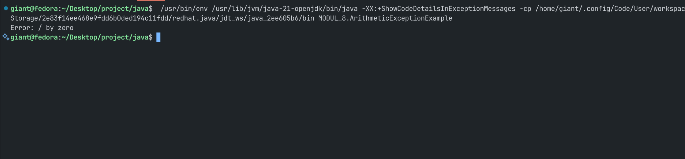
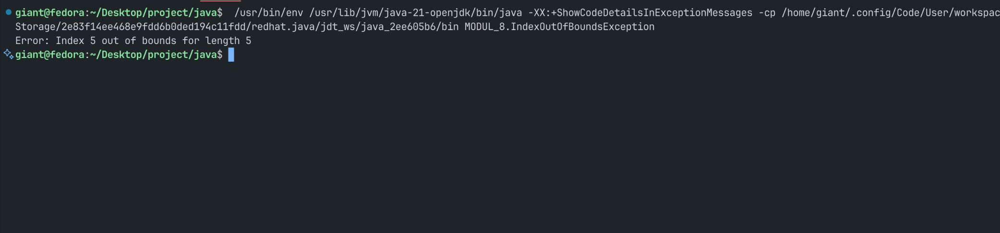

# Pemrograman Berorientasi Objek

## Praktikum Modul 8

**Disusun oleh:**  
**Nama:** Gian Alharitz Ueldy Secondri  
**NIM:** 11241033

---

### Tugas dan Deskripsi Singkat

1. Buatlah program sederhana yang menerapkan **exception handling** :
   - `ArithmeticException`
   - `IndexOutOfBoundsException`

---

## Pembahasan

#### `ArithmeticExceptionExample.java`

```java
// Deklarasi kelas utama
public class ArithmeticExceptionExample {

  // Metode main sebagai titik awal program
  public static void main(String[] args) {

    // Blok try digunakan untuk menangkap kemungkinan exception
    try {
      int a = 10;  // Mendeklarasikan dan menginisialisasi variabel a dengan nilai 10
      int b = 0;   // Mendeklarasikan dan menginisialisasi variabel b dengan nilai 0

      int c = a / b; // Operasi pembagian yang akan menyebabkan ArithmeticException (karena dibagi 0)

      System.out.println(c); // Tidak akan dijalankan karena exception terjadi sebelumnya
    }

    // Blok catch menangani exception jika terjadi pada blok try
    catch (ArithmeticException e) {
      // Menampilkan pesan error dari exception
      System.out.println("Error: " + e.getMessage()); // Akan menampilkan "Error: / by zero"
    }
  }
}
```

#### Output



#### `IndexOutOfBoundsException.java`

```java
// Mendefinisikan kelas publik dengan nama IndexOutOfBoundsException
public class IndexOutOfBoundsException {

  // Metode utama (entry point) dari program Java
  public static void main(String[] args) {

    try {
      // Membuat array integer dengan panjang 5 (indeks 0 sampai 4)
      int[] arr = new int[5];

      // Mencoba mengakses indeks ke-5 (yang tidak ada), ini akan menyebabkan exception
      arr[5] = 10;

    } catch (ArrayIndexOutOfBoundsException e) {
      // Menangkap kesalahan jika mengakses indeks di luar batas array
      // dan mencetak pesan kesalahan
      System.out.println("Error: " + e.getMessage());
    }
  }
}
```

#### Output


